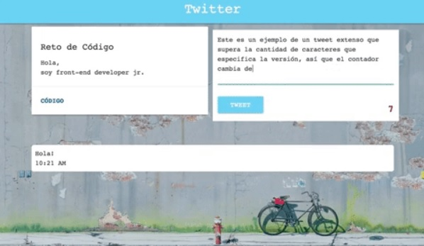

## RETO DE CÓDIGO: TWITTER

## OBJETIVO:
1. Replicar el newsfeed de Twitter.

## PRIMERA PARTE: MAQUETADO Y ESTILO CSS
1. El archivo index.html se encuentra enlazado con su hoja de estilos en el archivo style.css.
2. El archivo HTML se encuentra enlazado con las fuentes necesarias a utilizar (Google Fonts).
2. El archivo HTML cuenta con dos partes principales: un navegador y un contenedor.
3. En el contenedor se encuentran 3 secciones, cada una con los elementos correspondientes (p, text-area, button).

![Diagrama Maquetado] (assets/images/maquetado-twitter.png)

## SEGUNDA PARTE: CREANDO UN SITIO INTERACTIVO CON JS

![Diagrama de flujo]
